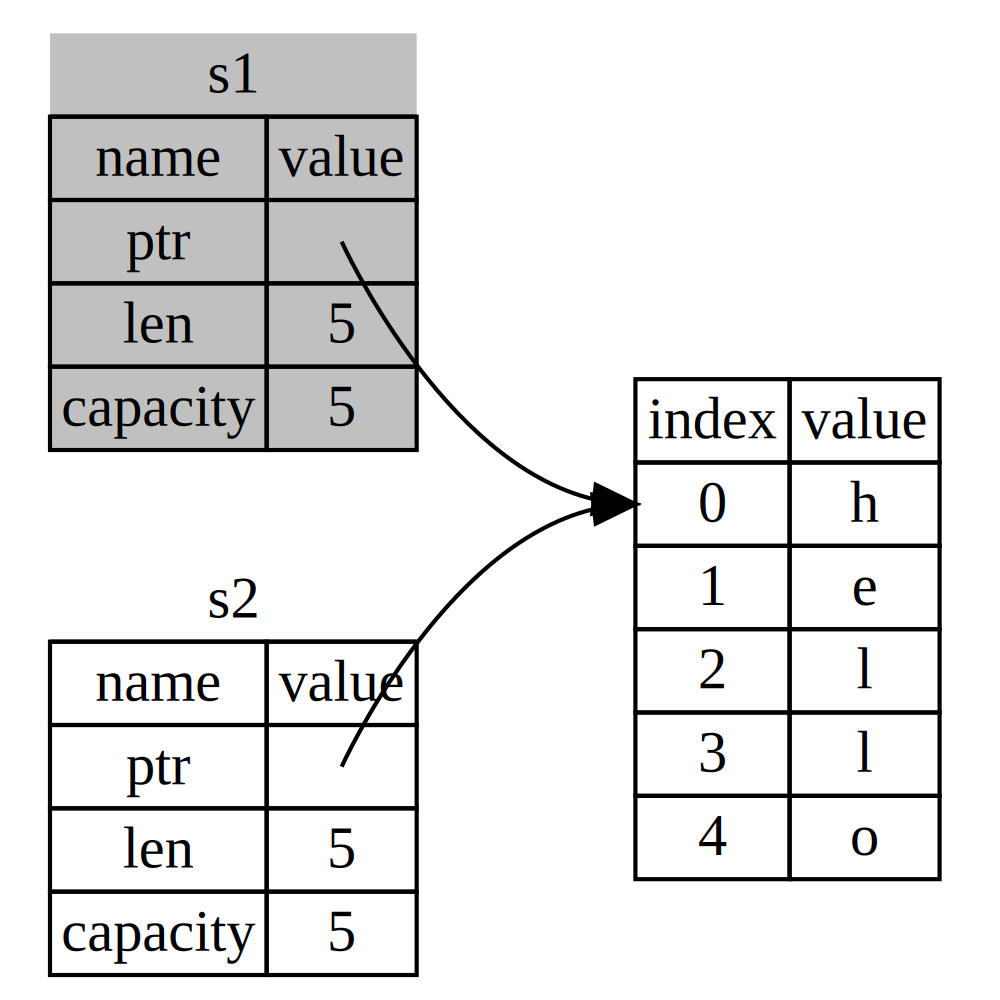

*Summary of [https://doc.rust-lang.org/book/ch04-00-understanding-ownership.html](https://doc.rust-lang.org/book/ch04-00-understanding-ownership.html)*

# Chapter 4 

## 4.1 Understanding Ownership

Rust ownership defines **a set of rules, checked at compile time, that govern how a Rust program manages (heap) memory**  (this differs from garbage collectors and programmatic (de)allocations). 

## Stack and Heap

### Stack

- Data with a known, fixed size.
- LIFO 
- The pointer to the stack is a known, fixed size.
- Function parameters are pushed onto the stack, and popped off the stack when the function is over.

### Heap

- Data with an unknown size at compile time, or a size that might change.
- Addressable by an allocated pointer.
- Allocation and Access to the heap is slower since it requires: (i) finding a big enough space, (ii) bookkeeping to prepare for the next allocation, and (iii) following a pointer to get there.

## Ownership Rules

- Each value in Rust has an *owner*.
- There can only be one owner at a time.
- When the owner goes out of scope, the value will be dropped.

## The String Type

- It manages data allocated on the heap, and as such is able to store an amount of text that is unknown at compile time.

```
{
    let mut s = String::from("hello"); // memory is requested to the allocator

    s.push_str(", world!"); // appends a literal to a String

    println!("{}", s); // `hello, world!` 
}
// s, which owns the String allocated memory goes out of scope
// thus, the memory is returned to the allocator by calling the *drop* function
```

- In the case of an inmutable string literal, the contents are known at compile time, so the text is hardcoded directly into the final executable. This makes string literals fast and efficient.

- With the String type, in order to support a mutable, growable piece of text, it is needed to allocate an amount of memory on the heap, unknown at compile time.

```
    let s1 = String::from("hello");
    let s2 = s1; // s1 is moved into s2
    // To ensure memory safety, Rust considers s1 as no longer valid.
```
 *Representation in memory of the variable s2 that has a copy of the pointer, length, and capacity of s1 - src: https://doc.rust-lang.org/book/ch04-01-what-is-ownership.html#variables-and-data-interacting-with-move*

## Variables and Data Interacting with Clone

The *Clone* method deeply copies the heap data of the String, not just the stack data.

```
    let s1 = String::from("hello");
    let s2 = s1.clone();

    println!("s1 = {}, s2 = {}", s1, s2);
```

## Stack-Only Data: Copy

Types such as integers that have a known size at compile time are stored entirely on the stack, resulting in quick copies of the actual values.

```
    let x = 5;
    let y = x;

    println!("x = {}, y = {}", x, y);
```

Rust has a special annotation called the *Copy* trait that can be placed on types that are stored on the stack, as integers are. If a type (typically any group of simple scalar values) implements the *Copy* trait, variables that use it do not move, but rather are trivially copied, making them still valid after assignment to another variable.

## Return Values and Scope

```
fn main() {
    let s1 = gives_ownership();         // gives_ownership moves its return
                                        // value into s1

    let s2 = String::from("hello");     // s2 comes into scope

    let s3 = takes_and_gives_back(s2);  // s2 is moved into
                                        // takes_and_gives_back, which also
                                        // moves its return value into s3
} // Here, s3 goes out of scope and is dropped. s2 was moved, so nothing
  // happens. s1 goes out of scope and is dropped.

fn gives_ownership() -> String {             // gives_ownership will move its
                                             // return value into the function
                                             // that calls it

    let some_string = String::from("yours"); // some_string comes into scope

    some_string                              // some_string is returned and
                                             // moves out to the calling
                                             // function
}

// This function takes a String and returns one
fn takes_and_gives_back(a_string: String) -> String { // a_string comes into
                                                      // scope

    a_string  // a_string is returned and moves out to the calling function
}
```

The ownership of a variable follows the same pattern every time: assigning a value to another variable moves it. When a variable that includes data on the heap goes out of scope, the value will be cleaned up by drop unless ownership of the data has been moved to another variable.

**However, Rust has a feature for using a value without transferring ownership, called references.**